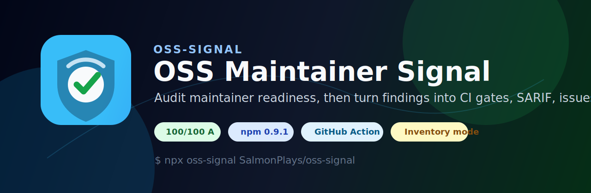
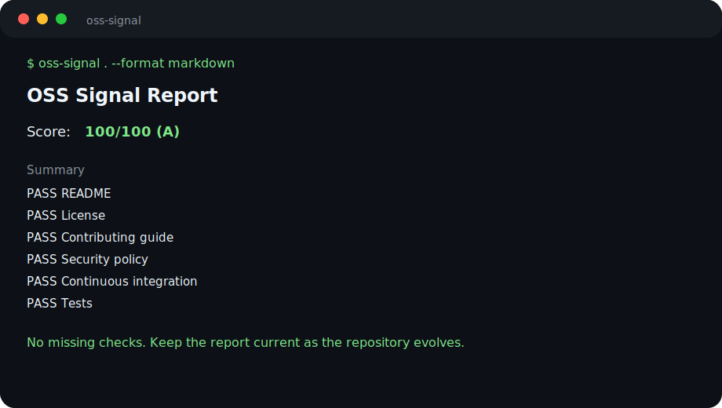
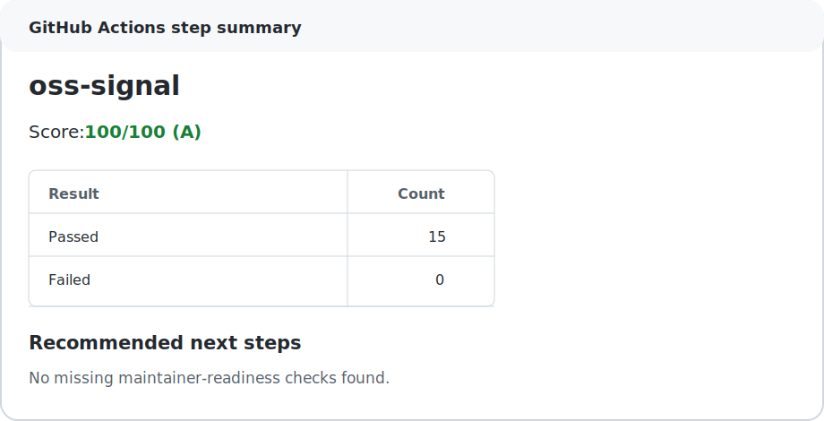

<p align="center">
  
</p>

# OSS Maintainer Signal (`oss-signal`)

[](https://github.com/SalmonPlays/oss-signal/actions/workflows/ci.yml)
[](https://github.com/SalmonPlays/oss-signal/actions/workflows/repository-health.yml)
[](https://github.com/SalmonPlays/oss-signal/actions/workflows/evidence-verify.yml)
[](https://github.com/SalmonPlays/oss-signal/actions/workflows/scorecard.yml)
[](https://github.com/SalmonPlays/oss-signal/releases/latest)
[](https://github.com/marketplace/actions/oss-signal)
[](https://www.npmjs.com/package/oss-signal)
[](https://www.npmjs.com/package/oss-signal)
[](docs/self-audit.md)
[](docs/reviewer-evidence.md)
[](LICENSE)

`oss-signal` is a dependency-light maintainer-readiness CLI and GitHub Action for OSS projects that need repeatable triage, CI evidence, SARIF, inventory reports, issue-ready cleanup notes, adoption packs, a transparent rule catalog, and no-fail workflow trials.

It checks the files and automation that reduce maintainer load: README, license, contributing guide, security policy, maintainer ownership, CI, tests, issue templates, pull request templates, Dependabot, and release notes. The output is a score plus concrete next steps in Markdown, JSON, SARIF, inventory, GitHub Issue-ready Markdown, PR-sized maintainer plan, no-fail workflow, adoption-pack, or rule-catalog formats.

## 30-Second Quick Start

Add a report-only workflow to the current repository:

```bash
npx oss-signal --init
```

This creates `.github/workflows/oss-signal-trial.yml`, including a manual trigger, pull-request trigger, Markdown report, adoption pack, and artifact upload. It does not add a failing score gate. Existing workflow files are protected unless you explicitly pass `--force`.

Run a maintainer-readiness report against any public GitHub repository:

```bash
npx oss-signal owner/repo --format markdown --output oss-signal-report.md
```

Generate an editable issue body before posting a cleanup suggestion:

```bash
npx oss-signal owner/repo --format issue --output maintainer-follow-up.md
```

Generate a no-fail GitHub Actions trial workflow:

```bash
npx oss-signal owner/repo --format workflow --output .github/workflows/oss-signal-trial.yml
```

Generate a copyable maintainer adoption pack:

```bash
npx oss-signal owner/repo --format adoption --output adoption-pack.md
```

Inspect the rule weights before posting feedback:

```bash
npx oss-signal --list-rules
```

For the full first-run path, see [docs/quickstart.md](docs/quickstart.md).



## Public Verification

If you are evaluating the project itself, the public verification path remains available without interrupting the normal user flow:

| Need | Link |
| --- | --- |
| Shortest verification path | [REVIEWER_PACKET.md](REVIEWER_PACKET.md) |
| Current post-submission status | [docs/selection-update-2026-06-13.md](docs/selection-update-2026-06-13.md) |
| Latest manual evidence refresh | [docs/evidence-refresh-2026-06-18.md](docs/evidence-refresh-2026-06-18.md) |
| Evidence ledger and boundaries | [docs/evidence-ledger.md](docs/evidence-ledger.md) |
| Community engagement and reciprocity boundary | [docs/community-engagement.md](docs/community-engagement.md) |
| Public acknowledgements | [ACKNOWLEDGEMENTS.md](ACKNOWLEDGEMENTS.md) |
| Adoption gap closure plan | [docs/adoption-gap-closure.md](docs/adoption-gap-closure.md) |
| Independent maintainer trial request | [docs/independent-workflow-run-request.md](docs/independent-workflow-run-request.md) |

Current public evidence includes `oss-signal@0.9.9` on npm, `SalmonPlays/oss-signal@v0.9.9` as a GitHub Action, a Marketplace listing, public CI/CodeQL/OpenSSF Scorecard/evidence workflows, PASS 16 / SKIP 0 / FAIL 0 evidence verification, one outside-maintainer-accepted PR, and one inbound external contributor PR from a public external fork. The project does not claim broad independent adoption yet.

## Who It Helps

- Maintainers who want a quick view of missing workflow signals before a release.
- Contributors who want to open small, reviewable documentation or automation PRs.
- Teams that need a repeatable CI artifact for repository health and maintainer-readiness.
- Foundations or working groups that need inventory reports across multiple repositories.

## Maintainer Evidence Snapshot

The shortest reviewer path is [REVIEWER_PACKET.md](REVIEWER_PACKET.md). Public evidence for the maintainer workflow is also collected in [docs/index.md](docs/index.md), [docs/quickstart.md](docs/quickstart.md), [docs/evidence-ledger.md](docs/evidence-ledger.md), [docs/community-engagement.md](docs/community-engagement.md), [ACKNOWLEDGEMENTS.md](ACKNOWLEDGEMENTS.md), [docs/trust-center.md](docs/trust-center.md), [docs/reviewer-evidence.md](docs/reviewer-evidence.md), [docs/adoption-evidence.md](docs/adoption-evidence.md), [docs/codex-for-oss-fit-gap.md](docs/codex-for-oss-fit-gap.md), [docs/adoption-gap-closure.md](docs/adoption-gap-closure.md), [docs/evidence-refresh-2026-06-18.md](docs/evidence-refresh-2026-06-18.md), [docs/selection-update-2026-06-13.md](docs/selection-update-2026-06-13.md), [docs/independent-workflow-run-request.md](docs/independent-workflow-run-request.md), [docs/adoption-kit.md](docs/adoption-kit.md), [docs/maintainer-trial.md](docs/maintainer-trial.md), [docs/maintainer-feedback.md](docs/maintainer-feedback.md), [docs/social-launch.md](docs/social-launch.md), [docs/architecture.md](docs/architecture.md), [docs/security-model.md](docs/security-model.md), [docs/json-output.md](docs/json-output.md), [docs/plan-output.md](docs/plan-output.md), [docs/sarif-code-scanning.md](docs/sarif-code-scanning.md), [docs/roadmap.md](docs/roadmap.md), [docs/post-submission-update.md](docs/post-submission-update.md), and [docs/brand.md](docs/brand.md).

- Landing page: https://salmonplays.github.io/oss-signal/
- Published package: [`oss-signal@0.9.9`](https://www.npmjs.com/package/oss-signal), with `latest` pointing at `0.9.9`.
- Published GitHub Action: [`SalmonPlays/oss-signal@v0.9.9`](https://github.com/SalmonPlays/oss-signal/tree/v0.9.9).
- GitHub Marketplace listing: https://github.com/marketplace/actions/oss-signal
- Trust center: [docs/trust-center.md](docs/trust-center.md)
- Quickstart: [docs/quickstart.md](docs/quickstart.md)
- Root reviewer packet: [REVIEWER_PACKET.md](REVIEWER_PACKET.md)
- Reviewer packet: [docs/reviewer-packet-2026-06-08.md](docs/reviewer-packet-2026-06-08.md)
- Evidence ledger: [docs/evidence-ledger.md](docs/evidence-ledger.md)
- Community engagement: [docs/community-engagement.md](docs/community-engagement.md)
- Acknowledgements: [ACKNOWLEDGEMENTS.md](ACKNOWLEDGEMENTS.md)
- Latest manual evidence refresh: [docs/evidence-refresh-2026-06-18.md](docs/evidence-refresh-2026-06-18.md)
- Evidence verification snapshot: [docs/evidence-verification.md](docs/evidence-verification.md)
- Codex for OSS fit/gap review: [docs/codex-for-oss-fit-gap.md](docs/codex-for-oss-fit-gap.md)
- Adoption gap closure plan: [docs/adoption-gap-closure.md](docs/adoption-gap-closure.md)
- Adoption kit: [docs/adoption-kit.md](docs/adoption-kit.md)
- Maintainer trial: [docs/maintainer-trial.md](docs/maintainer-trial.md)
- Maintainer feedback: [docs/maintainer-feedback.md](docs/maintainer-feedback.md)
- Social launch kit: [docs/social-launch.md](docs/social-launch.md)
- Architecture: [docs/architecture.md](docs/architecture.md)
- Security model: [docs/security-model.md](docs/security-model.md)
- JSON output contract and schemas: [docs/json-output.md](docs/json-output.md), [single-repository schema](docs/schema/json-output.schema.json), [inventory schema](docs/schema/inventory-output.schema.json), and [rule catalog schema](docs/schema/rules-catalog.schema.json)
- Configuration: [docs/configuration.md](docs/configuration.md)
- Rules and scoring weights: [docs/rules.md](docs/rules.md)
- Maintainer plan output: [docs/plan-output.md](docs/plan-output.md)
- SARIF Code Scanning walkthrough: [docs/sarif-code-scanning.md](docs/sarif-code-scanning.md)
- Roadmap: [docs/roadmap.md](docs/roadmap.md)
- Post-submission version note: the application may reference earlier evidence; `0.9.9` is the current maintained release and is documented in [docs/post-submission-update.md](docs/post-submission-update.md) and [docs/selection-update-2026-06-13.md](docs/selection-update-2026-06-13.md).
- Public checks: CI, Repository health, Repository inventory, Evidence verification, and CodeQL are passing on `main`.
- Security posture: OpenSSF Scorecard is scheduled, CodeQL is active, secret scanning push protection is enabled, Dependabot alerts/security updates/malware alerts are enabled, and private vulnerability reporting is enabled.
- Branch posture: `main` has branch protection to prevent force pushes and deletions while keeping direct maintainer maintenance possible.
- Governance posture: [MAINTAINERS.md](MAINTAINERS.md), [GOVERNANCE.md](GOVERNANCE.md), and [.github/CODEOWNERS](.github/CODEOWNERS) define ownership, review routing, and supported change scope.
- Community route: [Discussion #5](https://github.com/SalmonPlays/oss-signal/discussions/5) is the public maintainer-workflow thread for usage questions and rule feedback.
- Self-audit: this repository scores **100/100 (A)** locally and through GitHub URL mode.
- Field use: five currently visible field-audit issues and four currently visible follow-up PRs remain public, plus one outside-maintainer-accepted PR and one inbound external contributor PR from a public external fork. Historical reports whose public links disappeared are kept as local audit examples but are not counted as public adoption evidence.
- Merged external OSS contribution evidence: [icoretech/codex-action PR #24](https://github.com/icoretech/codex-action/pull/24) is a focused Codex Action documentation safety fix accepted by an outside maintainer, and [oss-signal PR #14](https://github.com/SalmonPlays/oss-signal/pull/14) is an inbound external contributor PR from the public [ded-furby/oss-signal](https://github.com/ded-furby/oss-signal) fork adding a compact JSON score example.
- Contributor intake: [good first issues](https://github.com/SalmonPlays/oss-signal/issues?q=is%3Aissue%20state%3Aopen%20label%3A%22good%20first%20issue%22) are labeled for small outside PRs.
- Inventory mode: the CLI and Action can audit a newline-delimited list of repositories for organization-level triage.
- Evidence verification: `npm run evidence:verify` checks npm latest, npm download API, GitHub release evidence, repository metadata, and current external issue/PR links; the workflow uploads a Markdown verification artifact and the current snapshot is in [docs/evidence-verification.md](docs/evidence-verification.md).
- Historical self-owned workflow demo: [oss-signal-adoption-demo](https://github.com/SalmonPlays/oss-signal-adoption-demo/actions/runs/27025632373) ran the public `v0.8.4` Action tag and uploaded Markdown, SARIF, Issue-ready, and no-fail workflow artifacts. Current `v0.9.9` workflow evidence comes from this repository's Repository health workflow; the next stronger external signal is still one maintainer-owned public run through [docs/independent-workflow-run-request.md](docs/independent-workflow-run-request.md).

## Why

Open-source projects often fail quietly because the maintainer workflow is undocumented. `oss-signal` gives maintainers a repeatable checklist they can run locally, in CI, or before asking contributors to help.

## Use Cases

- Maintainers can run it before publishing a new project.
- Contributors can attach a report to a cleanup issue or pull request.
- Teams can gate release readiness with `--fail-under`.
- Foundations and working groups can compare repository hygiene across many projects.
- CI maintainers can add it as a GitHub Action, show the score in the workflow summary, and publish the report as an artifact.

See [docs/maintainer-playbook.md](docs/maintainer-playbook.md) for a concrete maintainer workflow from audit to issue, PR, CI gate, and Code Scanning evidence.

## Install

```bash
npm install --global oss-signal
```

Try it without installing:

```bash
npx oss-signal SalmonPlays/oss-signal
```

Use it from GitHub Marketplace: https://github.com/marketplace/actions/oss-signal

For local development:

```bash
git clone https://github.com/SalmonPlays/oss-signal.git
cd oss-signal
npm install
npm test
```

## Usage

Audit the current directory:

```bash
oss-signal
```

Show a one-screen maintainer triage summary:

```bash
oss-signal SalmonPlays/oss-signal --format summary
```

Show the rule catalog and scoring weights:

```bash
oss-signal --list-rules
oss-signal --list-rules --format json --output rules-catalog.json
```

Audit a public GitHub repository without cloning it:

```bash
oss-signal https://github.com/SalmonPlays/oss-signal
oss-signal platformatic/massimo --format json
```

Write a Markdown report:

```bash
oss-signal /path/to/repo --format markdown --output oss-signal-report.md
```

Use JSON in automation:

```bash
oss-signal . --format json --fail-under 80
```

Print a compact shell-friendly score summary (`jq` optional):

```bash
oss-signal . --format json | jq -r '"score=\(.score) grade=\(.grade) source=\(.source)"'
```

See [docs/json-output.md](docs/json-output.md) for the JSON schema and fixture.

Document intentional exceptions with a local config:

```bash
oss-signal . --config .oss-signal.json --format markdown
```

See [docs/configuration.md](docs/configuration.md) for not-applicable rules and scoring behavior.

Audit multiple repositories from one newline-delimited inventory file:

```bash
oss-signal --inventory docs/examples/inventory-targets.txt --format markdown --output inventory-report.md
```

See [docs/examples/inventory-report.md](docs/examples/inventory-report.md) for a generated inventory report.

Write SARIF for GitHub Code Scanning or other dashboards:

```bash
oss-signal . --format sarif --output oss-signal.sarif
```

See [docs/sarif-code-scanning.md](docs/sarif-code-scanning.md) for the Code Scanning upload workflow and expected output.

Generate a report that can be attached to an issue:

```bash
oss-signal . --format markdown --output docs/maintainer-readiness.md
```

Generate a maintainer-friendly issue body:

```bash
oss-signal platformatic/massimo --format issue --output maintainer-follow-up.md
```

Generate a PR-sized maintainer plan:

```bash
oss-signal platformatic/massimo --format plan --output maintainer-plan.md
```

See [docs/plan-output.md](docs/plan-output.md) and [docs/examples/github-plan.md](docs/examples/github-plan.md) for an example.

Generate a maintainer adoption pack:

```bash
oss-signal platformatic/massimo --format adoption --output adoption-pack.md
```

The adoption pack combines a local trial command, no-fail workflow YAML, suggested maintainer message, decision checklist, current findings, verification links, and boundaries against overstating adoption.

Generate a no-fail GitHub Actions trial workflow:

```bash
oss-signal owner/repo --format workflow --output .github/workflows/oss-signal-trial.yml
```

See [docs/maintainer-trial.md](docs/maintainer-trial.md) and [docs/examples/maintainer-trial-workflow.yml](docs/examples/maintainer-trial-workflow.yml) for the generated workflow.

## Checks

`oss-signal` currently checks:

- Community files: README, license, contributing guide, security policy, code of conduct, changelog, support policy, maintainer ownership
- Automation: CI workflows, tests, issue templates, pull request template, Dependabot, CodeQL or similar security workflow
- Package hygiene: package metadata and lockfile presence

See [docs/rules.md](docs/rules.md) for rule details and scoring weights.

SARIF output reports failed maintainer-readiness checks as warning-level results. This lets teams upload the audit to code scanning dashboards while keeping the Markdown report available for maintainers. Issue output turns the same findings into a human-reviewed checklist that can be edited before posting. Plan output turns the findings into a PR-sized sequence with suggested files and acceptance criteria.

For GitHub URL audits, `oss-signal` reads the repository file tree through the GitHub API and also uses GitHub's community profile signal when available. This lets it detect organization-level files such as a shared code of conduct.

## Real Output

This repository audits itself at **100/100 (A)** and dogfoods the public GitHub Action:

```text
Score: 100/100 (A)

Summary:
- Passed: 16
- Failed: 0
- Total checks: 16
```

See [docs/self-audit.md](docs/self-audit.md) for the full local self-audit report, [docs/examples/github-url-report.md](docs/examples/github-url-report.md) for the GitHub URL audit output, [docs/examples/github-summary.txt](docs/examples/github-summary.txt) for compact summary output, [docs/examples/github-issue-body.md](docs/examples/github-issue-body.md) for issue output, [docs/examples/github-plan.md](docs/examples/github-plan.md) for plan output, [docs/examples/maintainer-trial-workflow.yml](docs/examples/maintainer-trial-workflow.yml) for workflow output, [docs/examples/adoption-pack.md](docs/examples/adoption-pack.md) for adoption-pack output, [docs/examples/self-audit.sarif](docs/examples/self-audit.sarif) for SARIF output, and [docs/examples/rules-catalog.json](docs/examples/rules-catalog.json) for the machine-readable rule catalog.

The [Repository health workflow](.github/workflows/repository-health.yml) runs `SalmonPlays/oss-signal@v0.9.9`, uploads the Markdown report and adoption pack as artifacts, includes a SHA256 checksum manifest, and uploads SARIF to GitHub Code Scanning on non-PR runs. The [Repository inventory workflow](.github/workflows/repository-inventory.yml) runs the inventory mode from CI and uploads a multi-repository report artifact.

## Field Audits

`oss-signal` has been run against public repositories to produce maintainer-readiness reports, respectful issue drafts, and focused follow-up PRs:

- [platformatic/massimo report](docs/outreach/platformatic-massimo-report.md), [issue #159](https://github.com/platformatic/massimo/issues/159), and [PR #160](https://github.com/platformatic/massimo/pull/160)
- [supermarkt/checkjebon report](docs/outreach/supermarkt-checkjebon-report.md), [issue #22](https://github.com/supermarkt/checkjebon/issues/22), and [PR #23](https://github.com/supermarkt/checkjebon/pull/23)
- [sammorrisdesign/interactive-feed report](docs/outreach/sammorrisdesign-interactive-feed-report.md), [issue #14](https://github.com/sammorrisdesign/interactive-feed/issues/14), and [PR #15](https://github.com/sammorrisdesign/interactive-feed/pull/15)
- [flox/install-flox-action report](docs/outreach/flox-install-flox-action-report.md), [issue #204](https://github.com/flox/install-flox-action/issues/204), and [PR #205](https://github.com/flox/install-flox-action/pull/205)
- [Divyesh-5981/signal-oss report](docs/outreach/divyesh-5981-signal-oss-report.md) and [issue #5](https://github.com/Divyesh-5981/signal-oss/issues/5)

See [docs/outreach](docs/outreach) for the reports and draft issue text. Drafts are not posted automatically; maintainers should only receive specific, useful, and respectful suggestions.

Historical audit reports for [Grovanni/oss-signal](docs/outreach/grovanni-oss-signal-report.md) and [noctemlabs/signal-oss](docs/outreach/noctemlabs-signal-oss-report.md) remain in the repository as examples, but their public issue or PR links were not verifiable on 2026-06-08 and are not counted as current public evidence.

Additional prepared outreach candidates are tracked in [docs/outreach/peer-shortlist-2026-06.md](docs/outreach/peer-shortlist-2026-06.md). The shortlist explicitly separates respectful, defensible candidates from low-signal mass outreach.

Additional focused external contribution evidence: [icoretech/codex-action PR #24](https://github.com/icoretech/codex-action/pull/24) was merged by an outside maintainer and updates Codex Action README examples to route generated output through environment variables before printing it from shell steps. [oss-signal PR #14](https://github.com/SalmonPlays/oss-signal/pull/14) was opened by an outside contributor and merged into this repository with a compact JSON score example.

For a compact maintainer/adoption summary, see [docs/adoption-evidence.md](docs/adoption-evidence.md). For a reviewer-oriented verification path, see [docs/reviewer-evidence.md](docs/reviewer-evidence.md).

Historical self-owned workflow evidence: [SalmonPlays/oss-signal-adoption-demo](https://github.com/SalmonPlays/oss-signal-adoption-demo) ran `SalmonPlays/oss-signal@v0.8.4` and produced a successful [workflow run](https://github.com/SalmonPlays/oss-signal-adoption-demo/actions/runs/27025632373) with Markdown, SARIF, Issue-ready, and no-fail workflow artifacts. It is retained as historical public workflow evidence, not as current `v0.9.9` adoption evidence.

## Example Recommendation Output

```text
Score: 86/100 (B)

Recommended next steps:
- Static security analysis: Add a CodeQL or equivalent security scanning workflow.
- Support policy: Add SUPPORT.md describing where to ask questions.
```

See [docs/examples/minimal-repo-report.md](docs/examples/minimal-repo-report.md) for a small repository example with missing maintainer files.

## Exit Codes

By default, `oss-signal` exits with `0` after writing a report.

When `--fail-under <score>` is provided, it exits with `1` if the score is below the threshold:

```bash
oss-signal . --fail-under 80
```

## GitHub Action

Add `oss-signal` directly to a GitHub Actions workflow:

```yaml
- uses: SalmonPlays/oss-signal@v0.9.9
  id: oss-signal
  with:
    fail-under: "80"
    output: oss-signal-report.md
    summary: "true"
- run: echo "score ${{ steps.oss-signal.outputs.score }} (${{ steps.oss-signal.outputs.grade }})"
```

The Action writes a concise GitHub Actions step summary by default, so reviewers can see the score and recommended next steps without downloading an artifact. Set `summary: "false"` to disable it.



Run an inventory from CI:

```yaml
- uses: SalmonPlays/oss-signal@v0.9.9
  env:
    GITHUB_TOKEN: ${{ github.token }}
  with:
    inventory: docs/examples/inventory-targets.txt
    output: inventory-report.md
    summary: "true"
```

Generate an editable Issue body from CI:

```yaml
- uses: SalmonPlays/oss-signal@v0.9.9
  with:
    format: issue
    output: maintainer-follow-up.md
    summary: "true"
```

Full workflow example:

```yaml
name: Repository health

on:
  pull_request:
  push:
    branches: [main]

env:
  FORCE_JAVASCRIPT_ACTIONS_TO_NODE24: "true"

jobs:
  oss-signal:
    runs-on: ubuntu-latest
    steps:
      - uses: actions/checkout@v6
      - uses: SalmonPlays/oss-signal@v0.9.9
        id: oss-signal
        with:
          fail-under: "80"
          output: oss-signal-report.md
          summary: "true"
      - uses: actions/upload-artifact@v7
        with:
          name: oss-signal-report
          path: oss-signal-report.md
```

See [docs/examples/github-action-workflow.yml](docs/examples/github-action-workflow.yml) for a copyable workflow, [docs/examples/github-inventory-workflow.yml](docs/examples/github-inventory-workflow.yml) for an inventory workflow, and [docs/examples/github-code-scanning-workflow.yml](docs/examples/github-code-scanning-workflow.yml) for a workflow that uploads SARIF to GitHub Code Scanning.

Upload SARIF to GitHub Code Scanning:

```yaml
permissions:
  contents: read
  security-events: write

steps:
  - uses: actions/checkout@v6
  - uses: SalmonPlays/oss-signal@v0.9.9
    with:
      format: sarif
      output: oss-signal.sarif
      summary: "true"
  - uses: github/codeql-action/upload-sarif@v4
    with:
      sarif_file: oss-signal.sarif
```

This repository dogfoods the public Action tag in [Repository health](.github/workflows/repository-health.yml), which runs `SalmonPlays/oss-signal@v0.9.9` against the repository, uploads Markdown and adoption-pack artifacts with a SHA256 manifest, and publishes SARIF to Code Scanning on non-PR runs.

You can also run the CLI directly in CI:

```yaml
- run: npx oss-signal . --format markdown --output oss-signal-report.md --fail-under 80
```

## Current Limitations

- It checks deterministic maintenance signals, not code quality or project importance.
- GitHub URL mode uses unauthenticated API requests unless `GITHUB_TOKEN` is set, so very heavy usage may hit GitHub rate limits.
- A high score does not prove a project is important. It proves the maintainer workflow is documented and automatable.

## Roadmap

- Ecosystem-specific profiles for Python, Rust, Go, and JavaScript packages
- Release automation and provenance metadata checks
- Maintainer score trends over time
- Organization-level repository inventory dashboards

## Release Process

Releases use the checklist in [docs/release-process.md](docs/release-process.md). The repository also includes a tag-triggered [release workflow](.github/workflows/release.yml) that verifies the package, creates a GitHub Release, and publishes to npm with Trusted Publishing provenance.

## Contributing

Contributions are welcome. Please read [CONTRIBUTING.md](CONTRIBUTING.md) before opening a pull request.

## Security

Please report security issues privately. See [SECURITY.md](SECURITY.md).

## License

MIT
