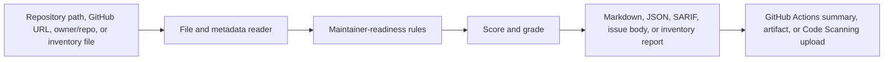

# Architecture

`oss-signal` is intentionally small: a Node.js CLI, a GitHub Action wrapper, and deterministic rule modules that inspect visible repository files and GitHub repository metadata.

## Components

| Component | Path | Responsibility |
| --- | --- | --- |
| CLI entrypoint | [src/cli.js](../src/cli.js) | Parses arguments, selects local/GitHub/inventory mode, writes reports, and applies `--fail-under`. |
| Audit engine | [src/index.js](../src/index.js) | Reads repository files, evaluates maintainer-readiness rules, scores results, and renders Markdown, JSON, SARIF, inventory, or issue output. |
| Action wrapper | [src/action.js](../src/action.js) | Maps GitHub Action inputs to CLI behavior, sets Action outputs, and writes the step summary. |
| Action metadata | [action.yml](../action.yml) | Defines Marketplace-visible inputs, outputs, branding, and Node runtime. |
| Rules reference | [docs/rules.md](rules.md) | Documents each rule, weight, and maintainer rationale. |

## Data Flow

## Local Repository Mode

Local mode reads files from the target path and checks for visible maintainer signals such as `README`, license, `CONTRIBUTING.md`, `SECURITY.md`, issue templates, pull request templates, CI, tests, Dependabot, CodeQL-style workflows, and release notes.

No network access is required for local mode.

## GitHub Repository Mode

GitHub URL mode fetches a public repository file tree through the GitHub API and checks the same visible signals without requiring a clone. When `GITHUB_TOKEN` is available, it can use the token for higher API rate limits. The token is not printed in output.

## Inventory Mode

Inventory mode reads a newline-delimited target list and runs the audit for each repository. It is designed for maintainers who need a quick portfolio view across several public repositories.

## Output Modes

- Markdown: human-readable maintainer report.
- JSON: automation-friendly result object.
- SARIF: warning-level findings for GitHub Code Scanning or other SARIF consumers.
- Issue: an editable maintainer follow-up body.
- Inventory: table and aggregate summary across multiple targets.

## Design Constraints

- Dependency-light by design.
- Deterministic scoring from visible repository signals.
- No hidden telemetry.
- No automatic issue or pull request posting.
- No claim that the score measures product quality, code quality, popularity, or security completeness.
