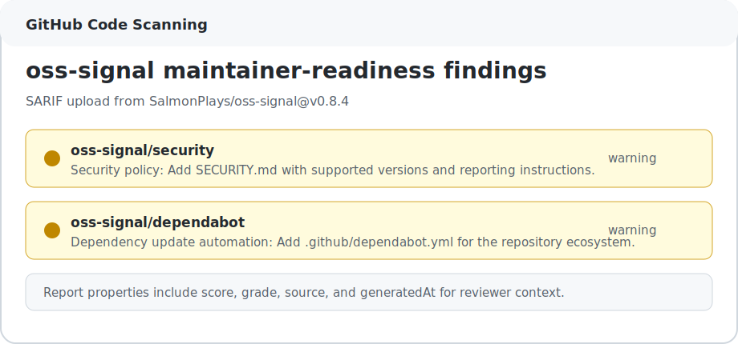

# SARIF Code Scanning Walkthrough

`oss-signal` can write SARIF so maintainer-readiness findings appear in GitHub Code Scanning alongside other repository signals.

SARIF findings are warning-level workflow hygiene findings. They are not confirmed security vulnerabilities.

## Minimal Workflow

```yaml
name: Repository health

on:
  pull_request:
  push:
    branches: [main]

permissions:
  contents: read
  security-events: write

env:
  FORCE_JAVASCRIPT_ACTIONS_TO_NODE24: "true"

jobs:
  oss-signal:
    runs-on: ubuntu-latest
    steps:
      - uses: actions/checkout@v5
      - uses: SalmonPlays/oss-signal@v0.8.6
        with:
          format: sarif
          output: oss-signal.sarif
          summary: "false"
      - uses: github/codeql-action/upload-sarif@v4
        if: github.event_name != 'pull_request'
        with:
          sarif_file: oss-signal.sarif
```

Why the permission is needed:

- `contents: read` lets the workflow inspect the repository checkout.
- `security-events: write` lets `github/codeql-action/upload-sarif` upload the SARIF file to Code Scanning.

The upload step is skipped on pull requests in the example because forks often do not have permission to upload security events.

## Expected Output

When checks fail, Code Scanning receives warning-level results with rule IDs like:

```text
oss-signal/security
oss-signal/pull-request-template
oss-signal/dependabot
```

Each result includes:

- A maintainer-readable message.
- The rule rationale.
- Suggested fix text.
- A likely repository file location for the missing signal.
- Report properties with the overall score, grade, source, and generation timestamp.

Example SARIF fixture:

- [examples/self-audit.sarif](examples/self-audit.sarif)

Complete workflow example:

- [examples/github-code-scanning-workflow.yml](examples/github-code-scanning-workflow.yml)



## Local Smoke Test

Generate SARIF locally:

```bash
oss-signal . --format sarif --output oss-signal.sarif
```

Validate that it is JSON and contains SARIF version `2.1.0`:

```bash
node -e "const s=JSON.parse(require('fs').readFileSync('oss-signal.sarif','utf8')); if (s.version !== '2.1.0') process.exit(1)"
```

## Maintainer Boundaries

Use SARIF as a visibility layer, not as a hard security claim. Missing `SECURITY.md`, Dependabot, CodeQL, or templates are repository maintenance gaps. They should be triaged with the same judgment as any other workflow warning.
